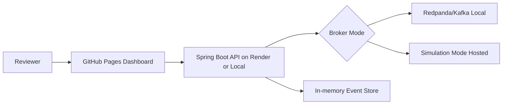
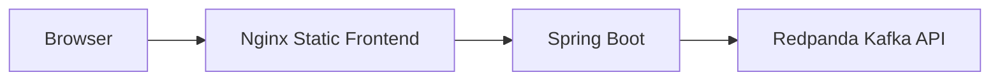
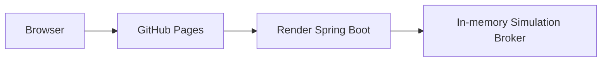

# High-Level Design

## System Context

## Components

- Dashboard: React/Vite static application hosted on GitHub Pages.
- API: Spring Boot REST service.
- Broker abstraction: common interface for Kafka and simulation modes.
- Worker: processes events, retries transient failures, routes failures to DLQ.
- Event store: in-memory recent event state for API and SSE.

## Deployment Topology

Local:

Hosted:

## Runtime Modes

- `EVENT_BROKER_MODE=kafka`: publishes to Kafka topics and consumes with Spring Kafka listeners.
- `EVENT_BROKER_MODE=simulation`: publishes into an async in-memory worker flow.
