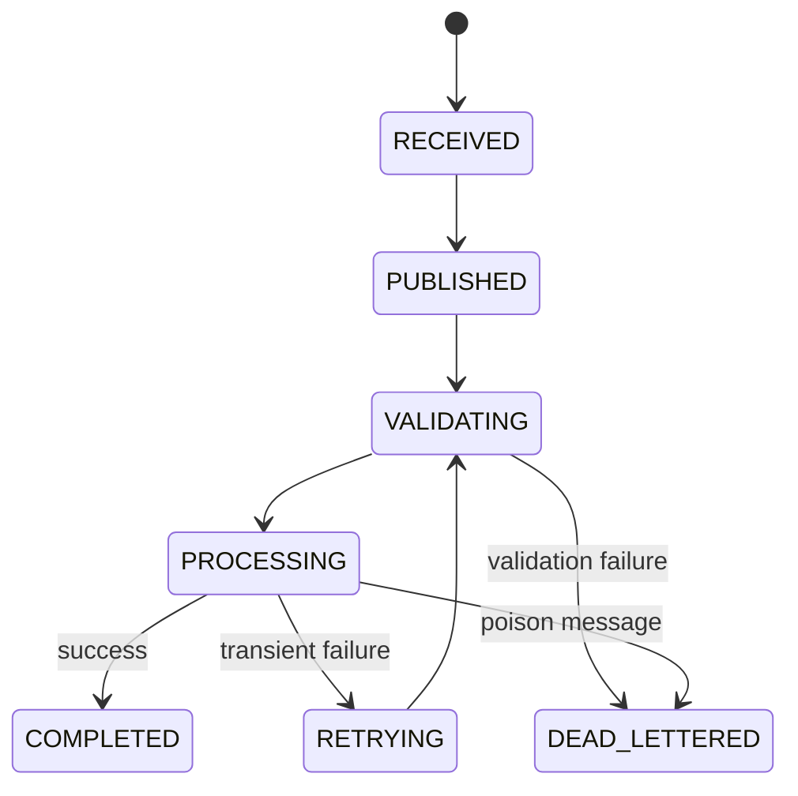
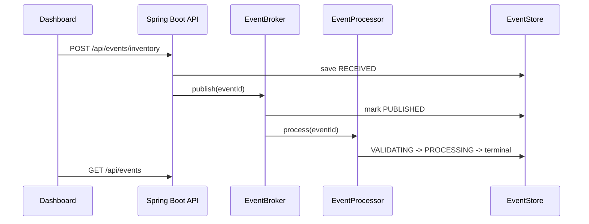

# Low-Level Design

## Package Design

- `api`: controllers, request DTOs, response DTOs, error handler.
- `domain`: event status, event scenario, event aggregate, timeline entry.
- `pipeline`: application service and event processor.
- `broker`: broker interface plus Kafka and simulation implementations.
- `metrics`: pipeline metrics snapshot.
- `store`: in-memory event store.
- `config`: app configuration, CORS, broker settings.

## State Machine

## Retry And DLQ Rules

- `SUCCESS`: completes on first processing attempt.
- `VALIDATION_FAILURE`: moves directly to `DEAD_LETTERED`.
- `TRANSIENT_FAILURE`: moves to `RETRYING` until `maxRetries`, then completes.
- `POISON_MESSAGE`: moves to `DEAD_LETTERED`.

## Sequence

